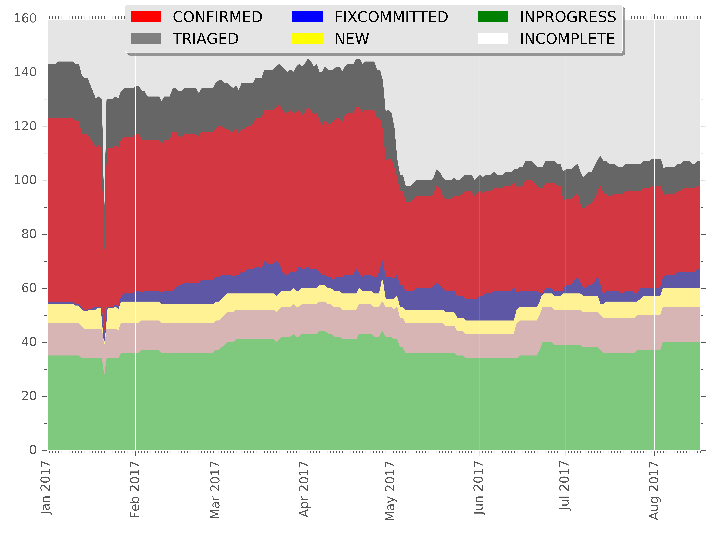

Bug counter of OpenStack Tempest
================================

This is a small tool for collecting the bug count of OpenStack Tempest from the launchpad.

Usage
-----

Register this script on your crontab($ crontab -e) like::

  0 5 * * * /home/<user>/tempest-bugs/count-tempest-bugs.sh

The data of each day is stored under tempest-bugs/data/<date>, and run merge-counts-into-single-csv.sh
to create merged data from whole days data. That would be easy to create some graph to know
current progress in the bug triage.

Current graph
-------------

